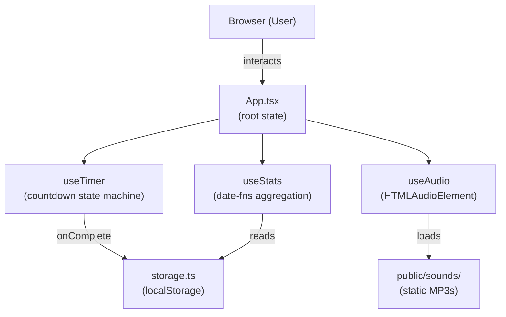
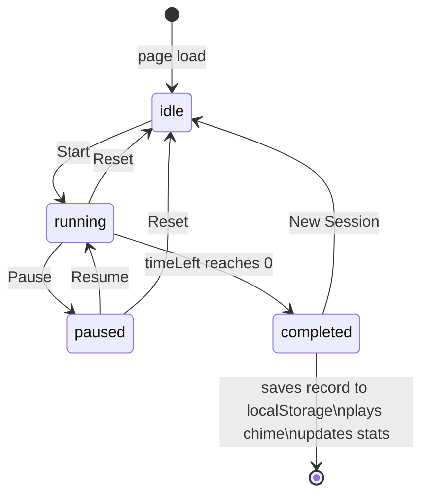

# Pomodoro

A minimal, dark-themed Pomodoro timer built for focused work sessions. Designed for students and teachers — pick a duration, name your task, start the timer, and let the background sound keep you in flow. Session history is stored locally so your stats are always there when you return.

Live at [pomodoro.dhirajbalakrishnan.dev](https://pomodoro.dhirajbalakrishnan.dev)

---

## Features

- **Configurable duration** — quick-select presets (15, 20, 25, 30, 45, 60 min) or type a custom value
- **Task label** — optionally name what you're working on before starting
- **Countdown timer** — large display with an SVG progress ring that fills as the session runs
- **Start / Pause / Resume / Reset** — full timer control; settings are locked while running
- **Completion chime** — a three-note Web Audio chime plays automatically when the session ends
- **Background sounds** — Rainfall, Ocean Waves, or Ambient Lo-fi; Play/Pause/Stop with volume slider
- **Session history** — every completed session is saved to `localStorage` with timestamp, task, and duration
- **Statistics dashboard** — total Pomodoros completed in the last 24 h, 7 days, 30 days, and 365 days
- **Recent sessions list** — last 10 completed sessions with time, task name, and duration

---

## Architecture



---

## Flow Diagram — Pomodoro Session



---

## Tech Stack

| Layer | Technology |
|---|---|
| Framework | React 19 (Create React App) |
| Language | TypeScript |
| Styling | Plain CSS with CSS custom properties (dark theme) |
| Date utilities | date-fns v4 |
| Audio | HTML5 `Audio` element (background music) + Web Audio API (chime) |
| Persistence | Browser `localStorage` |
| Fonts | Inter + JetBrains Mono (Google Fonts) |
| Hosting | Vercel (static) |

---

## Quick Start

See [help/dev.md](help/dev.md) for local setup and [help/prod.md](help/prod.md) for deployment.

```bash
npm install
npm start        # http://localhost:3000
npm run build    # production bundle → build/
```

---

## Environment Variables

This app has no environment variables. It is entirely client-side with no backend.

Audio files must be placed in `public/sounds/` before running:

| File | Description |
|---|---|
| `public/sounds/rainfall.mp3` | Rainfall background loop |
| `public/sounds/ocean.mp3` | Ocean waves background loop |
| `public/sounds/ambient.mp3` | Ambient / Lo-fi background loop |
